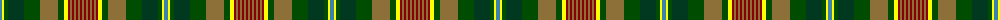

The parent of this is [Dixon, Clyde (Personal)](/tartans/b/4/y2/g4/dg16/g16/lt18/g6/y4/dr2/lt2/dr2/lt2/dr2/lt2/dr2/lt/2/)

This was sourced from register-of-tartans.  It is a [16 stripes tartan](/stripes/stripes16/).

Original link https://www.tartanregister.gov.uk/tartanDetails.aspx?ref=10966

## Thread count
B/4 Y2 G4 DG16 G16 LT18 G6 Y4 DR2 LT2 DR2 LT2 DR2 LT2 DR2 LT/2

## Palette
Each colour and its ΔE from the base-6 reference it is a variant of.

| Colour | Shade | Base | ΔE (OKLab) |
|---|---|---|---|
| B |  `#3C82AF` | B  | 0.20 |
| DG |  `#003820` | G  | 0.16 |
| DR |  `#880000` | R  | 0.14 |
| G |  `#004C00` | G  | 0.08 |
| LT |  `#8C7038` | G  | 0.18 |
| Y |  `#FFFF00` | Y  | 0.16 |

ID: /variants/b/4/y2/g4/dg16/g16/lt18/g6/y4/dr2/lt2/dr2/lt2/dr2/lt2/dr2/lt/2-b3c82af-dg003820-dr880000-g004c00-lt8c7038-yffff00/
