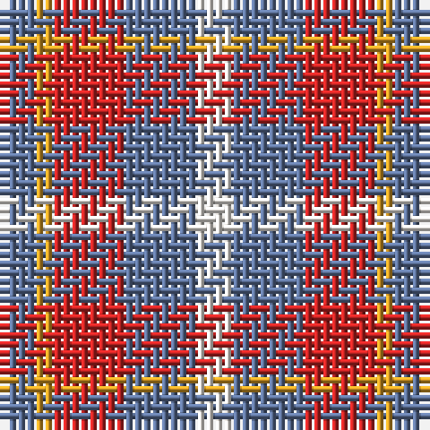

The parent of this is [Doohan (New South Wales), Andrew](/tartans/b/4/y2/r8/b8/w/4/)

This was sourced from register-of-tartans.  It is a [5 stripes tartan](/stripes/stripes5/).

Original link https://www.tartanregister.gov.uk/tartanDetails.aspx?ref=10759

## Thread count
B/4 Y2 R8 B8 W/4

## Palette
Each colour and its ΔE from the base-6 reference it is a variant of.

| Colour | Shade | Base | ΔE (OKLab) |
|---|---|---|---|
| B |  `#5F749C` | B  | 0.17 |
| R |  `#CA2625` | R  | 0.03 |
| W |  `#F9F5EF` | W  | 0.01 |
| Y |  `#E0A126` | Y  | 0.08 |

# Sample pattern

ID: /variants/b/4/y2/r8/b8/w/4-b5f749c-rca2625-wf9f5ef-ye0a126/
