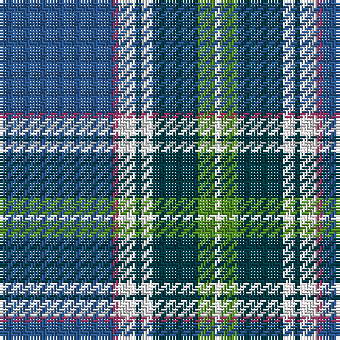

The parent of this is [Kruenaegel-Schropp Name Tartan Tartan Number: 10591. Earliest known date: 11 April 2012 Designed by Doris Maria Kruenaegel-Schropp to commemorate the Prussian and Bavarian origins of the Kruenaegel-Schropp family. Colours: blue and white represent the flags of both countries; green represents the hills of the Allgäu region of South Germany where the family currently reside; red-violet represents wisdom and dignity. See products available Copyright © Blair Urquhart, Comrie, 2015](/tartans/b/40/dr2/ln6/g2/ln4/g16/lg6/ln/2/)

This was sourced from house-of-tartan.  It is a [8 stripes tartan](/stripes/stripes8/).

Original link http://www.house-of-tartan.scotland.net/house/TartanViewjs.asp?colr=Def&tnam=10591

## Thread count
B/40 DR2 LN6 G2 LN4 G16 LG6 LN/2

## Palette
Each colour and its ΔE from the base-6 reference it is a variant of.

| Colour | Shade | Base | ΔE (OKLab) |
|---|---|---|---|
| B |  `#2C5890` | B  | 0.07 |
| DR |  `#902C58` | R  | 0.14 |
| G |  `#043C48` | B  | 0.11 |
| LG |  `#549028` | G  | 0.16 |
| LN |  `#E8E8E8` | W  | 0.04 |

# Sample pattern

ID: /variants/b/40/dr2/ln6/g2/ln4/g16/lg6/ln/2-b2c5890-dr902c58-g043c48-lg549028-lne8e8e8/
