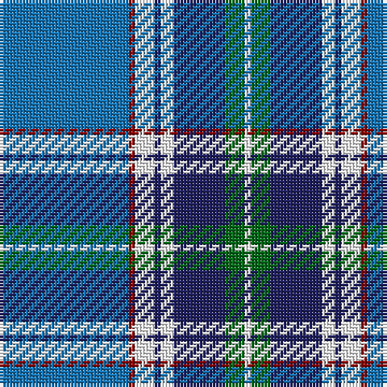

The parent of this is [Kruenaegel and Schropp (Name)](/tartans/b/40/dr2/w6/db2/w4/db16/g6/w/2/)

This was sourced from tartans-authority.  It is a [8 stripes tartan](/stripes/stripes8/).

Original link http://www.tartansauthority.com/tartan-ferret/display/10591/

## Thread count
B/40 DR2 W6 DB2 W4 DB16 G6 W/2

## Palette
Each colour and its ΔE from the base-6 reference it is a variant of.

| Colour | Shade | Base | ΔE (OKLab) |
|---|---|---|---|
| B |  `#1474B4` | B  | 0.15 |
| DB |  `#202060` | B  | 0.11 |
| DR |  `#880000` | R  | 0.14 |
| G |  `#006818` | G  | 0.02 |
| W |  `#FCFCFC` | W  | 0.03 |

# Sample pattern

ID: /variants/b/40/dr2/w6/db2/w4/db16/g6/w/2-b1474b4-db202060-dr880000-g006818-wfcfcfc/
