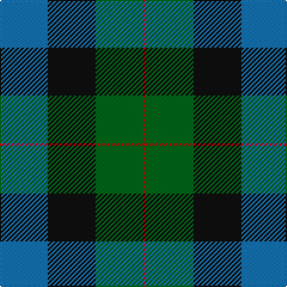

The parent of this is [Gunn (2011) Personal Tartan Tartan Number: 10459. Earliest known date: 17th July 2011 This is a variation on the original Gunn tartan, created in memory of the designer's grandfather, William Jesse Gunn and intended principally for the designer and his immediate family. See products available Copyright © Blair Urquhart, Comrie, 2015](/tartans/b/40/k40/g40/r/2/)

This was sourced from house-of-tartan.  It is a [4 stripes tartan](/stripes/stripes4/).

Original link http://www.house-of-tartan.scotland.net/house/TartanViewjs.asp?colr=Def&tnam=10459

## Thread count
B/40 K40 G40 R/2

## Palette
Each colour and its ΔE from the base-6 reference it is a variant of.

| Colour | Shade | Base | ΔE (OKLab) |
|---|---|---|---|
| B |  `#1474B4` | B  | 0.15 |
| DR |  `#880000` | R  | 0.14 |
| G |  `#006818` | G  | 0.02 |
| K |  `#101010` | K  | 0.17 |
| R |  `#C80000` | R  | 0.00 |

# Sample pattern

ID: /variants/b/40/k40/g40/r/2-b1474b4-dr880000-g006818-k101010-rc80000/
