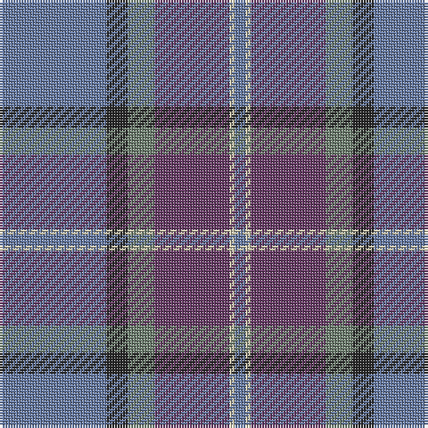

The parent of this is [Riley's Theme Commemorative Tartan Tartan Number: 10657. Earliest known date: 04/07/2012 This tartan was created for Riley Hagel as a thank-you for helping the designer recover from two reconstructive surgeries, one in 2006 and one in 2007. See products available Copyright © Blair Urquhart, Comrie, 2015](/tartans/b/40/k8/n10/nb28/na2/b/4/)

This was sourced from house-of-tartan.  It is a [6 stripes tartan](/stripes/stripes6/).

Original link http://www.house-of-tartan.scotland.net/house/TartanViewjs.asp?colr=Def&tnam=10657

## Thread count
B/40 K8 N10 Nb28 Na2 B/4

## Palette
Each colour and its ΔE from the base-6 reference it is a variant of.

| Colour | Shade | Base | ΔE (OKLab) |
|---|---|---|---|
| B |  `#667AA3` | B  | 0.19 |
| K |  `#292929` | B  | 0.16 |
| N |  `#6F8070` | G  | 0.19 |
| Na |  `#CCC7AD` | Y  | 0.13 |
| Nb |  `#683C66` | B  | 0.11 |

# Sample pattern

ID: /variants/b/40/k8/n10/nb28/na2/b/4-b667aa3-k292929-n6f8070-naccc7ad-nb683c66/
