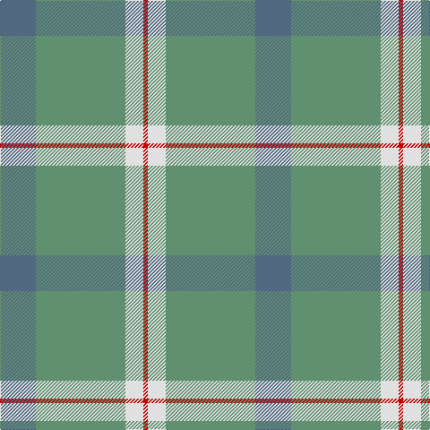

The parent of this is [Farooq (Personal)](/tartans/b/40/lg100/ln20/r/5/)

This was sourced from tartans-authority.  It is a [4 stripes tartan](/stripes/stripes4/).

Original link http://www.tartansauthority.com/tartan-ferret/display/10258/

## Thread count
B/40 LG100 LN20 R/5

## Palette
Each colour and its ΔE from the base-6 reference it is a variant of.

| Colour | Shade | Base | ΔE (OKLab) |
|---|---|---|---|
| B |  `#506880` | B  | 0.13 |
| LG |  `#609070` | G  | 0.19 |
| LN |  `#E0E0E0` | W  | 0.06 |
| R |  `#C80000` | R  | 0.00 |

# Sample pattern

ID: /variants/b/40/lg100/ln20/r/5-b506880-lg609070-lne0e0e0-rc80000/
