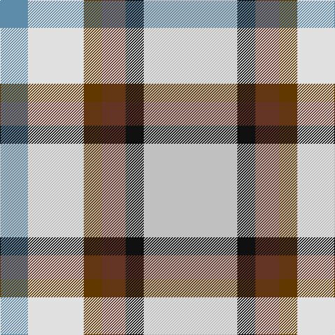

The parent of this is [MacGregor-Ryan (Personal)](/tartans/b/40/ln80/ta26/t34/k26/n/134/)

This was sourced from tartans-authority.  It is a [6 stripes tartan](/stripes/stripes6/).

Original link http://www.tartansauthority.com/tartan-ferret/display/11030/

## Thread count
B/40 LN80 Ta26 T34 K26 N/134

## Palette
Each colour and its ΔE from the base-6 reference it is a variant of.

| Colour | Shade | Base | ΔE (OKLab) |
|---|---|---|---|
| B |  `#5C8CA8` | B  | 0.23 |
| K |  `#101010` | K  | 0.17 |
| LN |  `#E0E0E0` | W  | 0.06 |
| N |  `#C0C0C0` | W  | 0.16 |
| T |  `#643424` | B  | 0.17 |
| Ta |  `#603800` | G  | 0.16 |

# Sample pattern

ID: /variants/b/40/ln80/ta26/t34/k26/n/134-b5c8ca8-k101010-lne0e0e0-nc0c0c0-t643424-ta603800/
