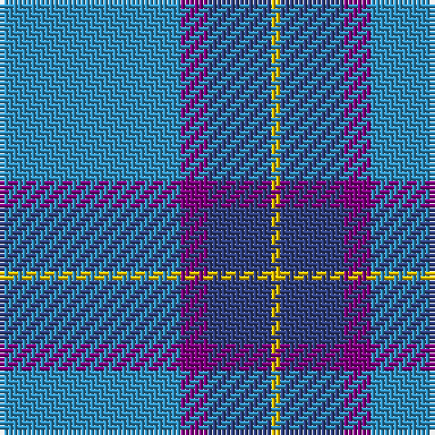

The parent of this is [Peacock](/tartans/b/40/p6/ba14/y/2/)

This was sourced from weddslist.  It is a [4 stripes tartan](/stripes/stripes4/).

Original link http://www.weddslist.com/cgi-bin/tartans/pg.pl?source=sts

## Thread count
B/40 P6 Ba14 Y/2

## Palette
Each colour and its ΔE from the base-6 reference it is a variant of.

| Colour | Shade | Base | ΔE (OKLab) |
|---|---|---|---|
| B |  `#3090C0` | B  | 0.23 |
| Ba |  `#304080` | B  | 0.01 |
| P |  `#800080` | B  | 0.17 |
| Y |  `#F0C000` | Y  | 0.01 |

# Sample pattern

ID: /variants/b/40/p6/ba14/y/2-b3090c0-ba304080-p800080-yf0c000/
