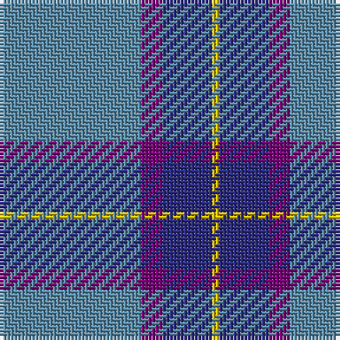

The parent of this is [Peacock (Name)](/tartans/b/40/p6/db14/y/2/)

This was sourced from tartans-authority.  It is a [4 stripes tartan](/stripes/stripes4/).

Original link http://www.tartansauthority.com/tartan-ferret/display/2655/

## Thread count
B/40 P6 DB14 Y/2

## Palette
Each colour and its ΔE from the base-6 reference it is a variant of.

| Colour | Shade | Base | ΔE (OKLab) |
|---|---|---|---|
| B |  `#5C8CA8` | B  | 0.23 |
| DB |  `#2C2C80` | B  | 0.05 |
| P |  `#780078` | B  | 0.16 |
| Y |  `#E8C000` | Y  | 0.00 |

# Sample pattern

ID: /variants/b/40/p6/db14/y/2-b5c8ca8-db2c2c80-p780078-ye8c000/
