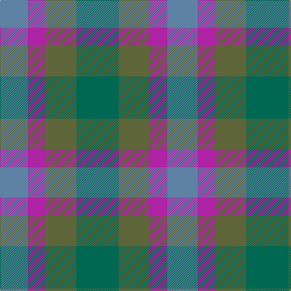

The parent of this is [Dunans Rising](/tartans/b/42/b4/p30/ga50/g/70/)

This was sourced from register-of-tartans.  It is a [5 stripes tartan](/stripes/stripes5/).

Original link https://www.tartanregister.gov.uk/tartanDetails.aspx?ref=10821

## Thread count
B/42 B4 P30 Ga50 G/70

## Palette
Each colour and its ΔE from the base-6 reference it is a variant of.

| Colour | Shade | Base | ΔE (OKLab) |
|---|---|---|---|
| B |  `#5E82A3` | B  | 0.21 |
| G |  `#006752` | G  | 0.09 |
| Ga |  `#5E6639` | G  | 0.11 |
| P |  `#AF23A5` | R  | 0.21 |

# Sample pattern

ID: /variants/b/42/b4/p30/ga50/g/70-b5e82a3-g006752-ga5e6639-paf23a5/
