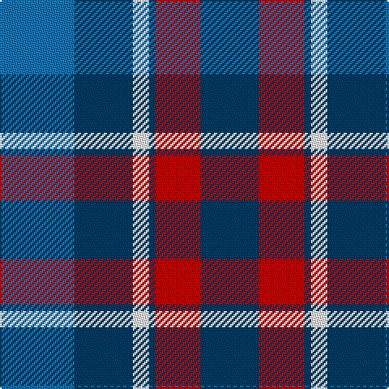

The parent of this is [Pitt (Name)](/tartans/b/46/db36/w10/db4/r28/db/36/)

This was sourced from tartans-authority.  It is a [6 stripes tartan](/stripes/stripes6/).

Original link http://www.tartansauthority.com/tartan-ferret/display/10376/

## Thread count
B/46 DB36 W10 DB4 R28 DB/36

## Palette
Each colour and its ΔE from the base-6 reference it is a variant of.

| Colour | Shade | Base | ΔE (OKLab) |
|---|---|---|---|
| B |  `#1474B4` | B  | 0.15 |
| DB |  `#003C64` | B  | 0.07 |
| R |  `#C80000` | R  | 0.00 |
| W |  `#FCFCFC` | W  | 0.03 |

# Sample pattern

ID: /variants/b/46/db36/w10/db4/r28/db/36-b1474b4-db003c64-rc80000-wfcfcfc/
