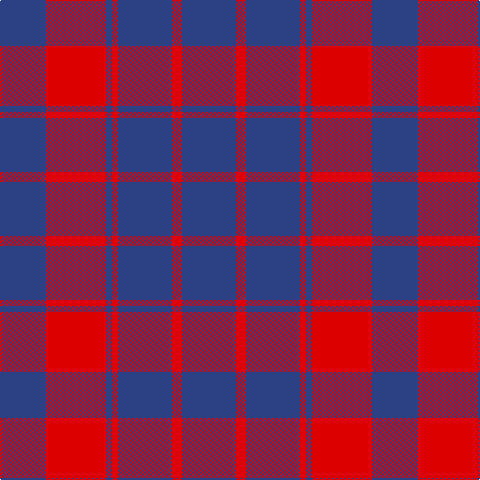

The parent of this is [Unidentified Plaid #10](/tartans/b/46/r60/b6/r6/b54/r10/b/54/)

This was sourced from register-of-tartans.  It is a [7 stripes tartan](/stripes/stripes7/).

Original link https://www.tartanregister.gov.uk/tartanDetails.aspx?ref=4343

## Thread count
B/46 R60 B6 R6 B54 R10 B/54

## Palette
Each colour and its ΔE from the base-6 reference it is a variant of.

| Colour | Shade | Base | ΔE (OKLab) |
|---|---|---|---|
| B |  `#2C4084` | B  | 0.00 |
| R |  `#DC0000` | R  | 0.04 |

# Sample pattern

ID: /variants/b/46/r60/b6/r6/b54/r10/b/54-b2c4084-rdc0000/
