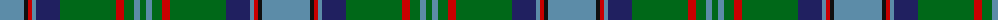

The parent of this is [Downie (Name)](/tartans/b/48/k4/r4/b4/db24/g56/r8/g10/b6/g/6/)

This was sourced from tartans-authority.  It is a [10 stripes tartan](/stripes/stripes10/).

Original link http://www.tartansauthority.com/tartan-ferret/display/8563/

## Thread count
B/48 K4 R4 B4 DB24 G56 R8 G10 B6 G/6

## Palette
Each colour and its ΔE from the base-6 reference it is a variant of.

| Colour | Shade | Base | ΔE (OKLab) |
|---|---|---|---|
| B |  `#5C8CA8` | B  | 0.23 |
| DB |  `#202060` | B  | 0.11 |
| G |  `#006818` | G  | 0.02 |
| K |  `#101010` | K  | 0.17 |
| R |  `#C80000` | R  | 0.00 |

ID: /variants/b/48/k4/r4/b4/db24/g56/r8/g10/b6/g/6-b5c8ca8-db202060-g006818-k101010-rc80000/
