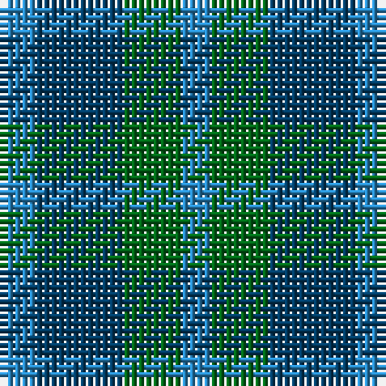

The parent of this is [Sheffield High (School)](/tartans/b/5/db12/g8/b/4/)

This was sourced from tartans-authority.  It is a [4 stripes tartan](/stripes/stripes4/).

Original link http://www.tartansauthority.com/tartan-ferret/display/3203/

## Thread count
B/5 DB12 G8 B/4

## Palette
Each colour and its ΔE from the base-6 reference it is a variant of.

| Colour | Shade | Base | ΔE (OKLab) |
|---|---|---|---|
| B |  `#2888C4` | B  | 0.21 |
| DB |  `#003C64` | B  | 0.07 |
| G |  `#006818` | G  | 0.02 |

# Sample pattern

ID: /variants/b/5/db12/g8/b/4-b2888c4-db003c64-g006818/
