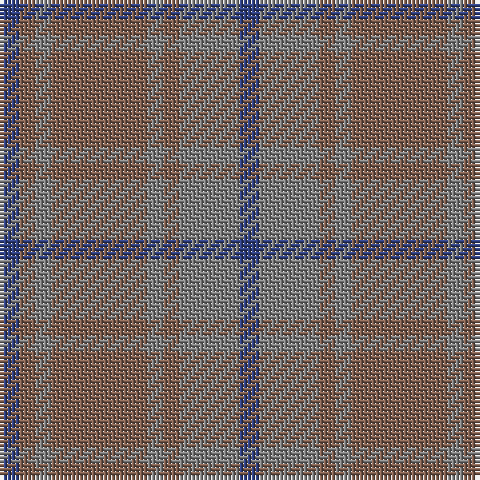

The parent of this is [Daks, (Muted Skye)](/tartans/b/5/lt4/n4/lt24/n4/lt4/n15/b/5/)

This was sourced from weddslist.  It is a [8 stripes tartan](/stripes/stripes8/).

Original link http://www.weddslist.com/cgi-bin/tartans/pg.pl?source=sts

## Thread count
B/5 LT4 N4 LT24 N4 LT4 N15 B/5

## Palette
Each colour and its ΔE from the base-6 reference it is a variant of.

| Colour | Shade | Base | ΔE (OKLab) |
|---|---|---|---|
| B |  `#304080` | B  | 0.01 |
| LT |  `#806050` | R  | 0.17 |
| N |  `#808080` | G  | 0.22 |

# Sample pattern

ID: /variants/b/5/lt4/n4/lt24/n4/lt4/n15/b/5-b304080-lt806050-n808080/
