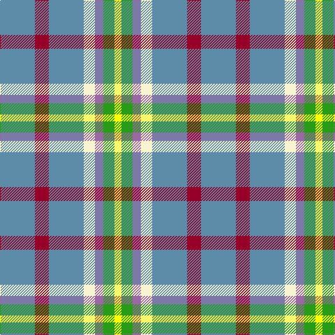

The parent of this is [Barneys (Scunthorpe) (Personal)](/tartans/b/50/dr20/b50/ly16/lp12/g16/y/10/)

This was sourced from register-of-tartans.  It is a [7 stripes tartan](/stripes/stripes7/).

Original link https://www.tartanregister.gov.uk/tartanDetails.aspx?ref=10954

## Thread count
B/50 DR20 B50 LY16 LP12 G16 Y/10

## Palette
Each colour and its ΔE from the base-6 reference it is a variant of.

| Colour | Shade | Base | ΔE (OKLab) |
|---|---|---|---|
| B |  `#5C8CA8` | B  | 0.23 |
| DR |  `#960028` | R  | 0.11 |
| G |  `#289C18` | G  | 0.18 |
| LP |  `#9C68A4` | R  | 0.21 |
| LY |  `#F8F4D0` | W  | 0.04 |
| Y |  `#FFFF00` | Y  | 0.16 |

# Sample pattern

ID: /variants/b/50/dr20/b50/ly16/lp12/g16/y/10-b5c8ca8-dr960028-g289c18-lp9c68a4-lyf8f4d0-yffff00/
