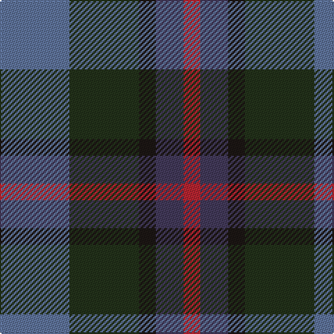

The parent of this is [Breon (Jersey Shore, Pennsylvania) (Personal)](/tartans/b/50/k50/ka12/n20/r/12/)

This was sourced from register-of-tartans.  It is a [5 stripes tartan](/stripes/stripes5/).

Original link https://www.tartanregister.gov.uk/tartanDetails.aspx?ref=10488

## Thread count
B/50 K50 Ka12 N20 R/12

## Palette
Each colour and its ΔE from the base-6 reference it is a variant of.

| Colour | Shade | Base | ΔE (OKLab) |
|---|---|---|---|
| B |  `#5F749C` | B  | 0.17 |
| K |  `#23321B` | G  | 0.17 |
| Ka |  `#1C1714` | K  | 0.21 |
| N |  `#433A5A` | B  | 0.08 |
| R |  `#B62531` | R  | 0.04 |

# Sample pattern

ID: /variants/b/50/k50/ka12/n20/r/12-b5f749c-k23321b-ka1c1714-n433a5a-rb62531/
