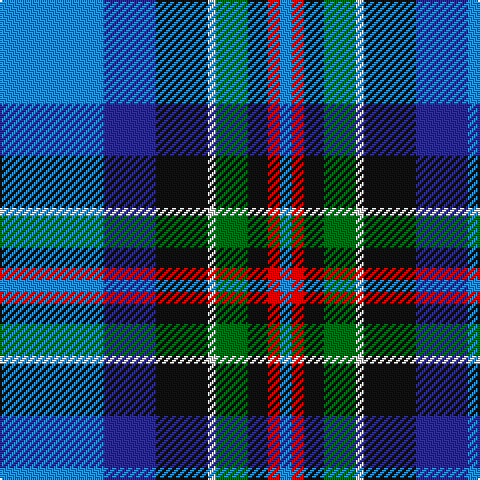

The parent of this is [Moran (Coilessan) (Personal)](/tartans/b/52/db26/k26/ln4/g16/k10/r6/b/6/)

This was sourced from register-of-tartans.  It is a [8 stripes tartan](/stripes/stripes8/).

Original link https://www.tartanregister.gov.uk/tartanDetails.aspx?ref=6005

## Thread count
B/52 DB26 K26 LN4 G16 K10 R6 B/6

## Palette
Each colour and its ΔE from the base-6 reference it is a variant of.

| Colour | Shade | Base | ΔE (OKLab) |
|---|---|---|---|
| B |  `#2888C4` | B  | 0.21 |
| DB |  `#2C2C80` | B  | 0.05 |
| G |  `#006818` | G  | 0.02 |
| K |  `#101010` | K  | 0.17 |
| LN |  `#E0E0E0` | W  | 0.06 |
| R |  `#C80000` | R  | 0.00 |

# Sample pattern

ID: /variants/b/52/db26/k26/ln4/g16/k10/r6/b/6-b2888c4-db2c2c80-g006818-k101010-lne0e0e0-rc80000/
