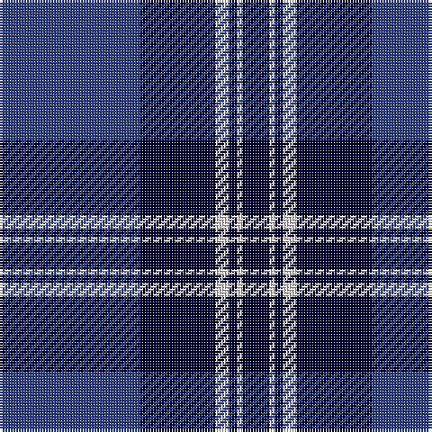

The parent of this is [St Andrews, Earl of](/tartans/b/52/db28/ln5/db3/ln2/db/10/)

This was sourced from weddslist.  It is a [6 stripes tartan](/stripes/stripes6/).

Original link http://www.weddslist.com/cgi-bin/tartans/pg.pl?source=sts

## Thread count
B/52 DB28 LN5 DB3 LN2 DB/10

## Palette
Each colour and its ΔE from the base-6 reference it is a variant of.

| Colour | Shade | Base | ΔE (OKLab) |
|---|---|---|---|
| B |  `#304080` | B  | 0.01 |
| DB |  `#000030` | K  | 0.17 |
| LN |  `#E0E0E0` | W  | 0.06 |

# Sample pattern

ID: /variants/b/52/db28/ln5/db3/ln2/db/10-b304080-db000030-lne0e0e0/
