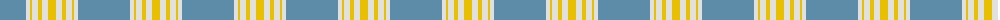

The parent of this is [Argentine Flag Fashion Tartan Tartan Number: 10007. Earliest known date: Jan. 2004 This tartan has been created to be a seamlessly tileable version of the Argentine flag for a computer screen. See products available Copyright © Blair Urquhart, Comrie, 2015](/tartans/b/52/ln4/y2/ln6/y4/ln6/y/8/)

This was sourced from house-of-tartan.  It is a [7 stripes tartan](/stripes/stripes7/).

Original link http://www.house-of-tartan.scotland.net/house/TartanViewjs.asp?colr=Def&tnam=10007

## Thread count
B/52 LN4 Y2 LN6 Y4 LN6 Y/8

## Palette
Each colour and its ΔE from the base-6 reference it is a variant of.

| Colour | Shade | Base | ΔE (OKLab) |
|---|---|---|---|
| B |  `#5C8CA8` | B  | 0.23 |
| LN |  `#E0E0E0` | W  | 0.06 |
| O |  `#E86000` | R  | 0.14 |
| Y |  `#E8C000` | Y  | 0.00 |

# Sample pattern

ID: /variants/b/52/ln4/y2/ln6/y4/ln6/y/8-b5c8ca8-lne0e0e0-oe86000-ye8c000/
