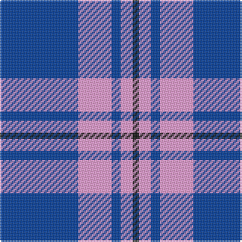

The parent of this is [Debbie Munro Memorial (Corporate)](/tartans/b/52/lp22/b6/lp8/k/4/)

This was sourced from tartans-authority.  It is a [5 stripes tartan](/stripes/stripes5/).

Original link http://www.tartansauthority.com/tartan-ferret/display/7638/

## Thread count
B/52 LP22 B6 LP8 K/4

## Palette
Each colour and its ΔE from the base-6 reference it is a variant of.

| Colour | Shade | Base | ΔE (OKLab) |
|---|---|---|---|
| B |  `#003C9C` | B  | 0.05 |
| K |  `#101010` | K  | 0.17 |
| LP |  `#FC9CD4` | W  | 0.21 |

# Sample pattern

ID: /variants/b/52/lp22/b6/lp8/k/4-b003c9c-k101010-lpfc9cd4/
