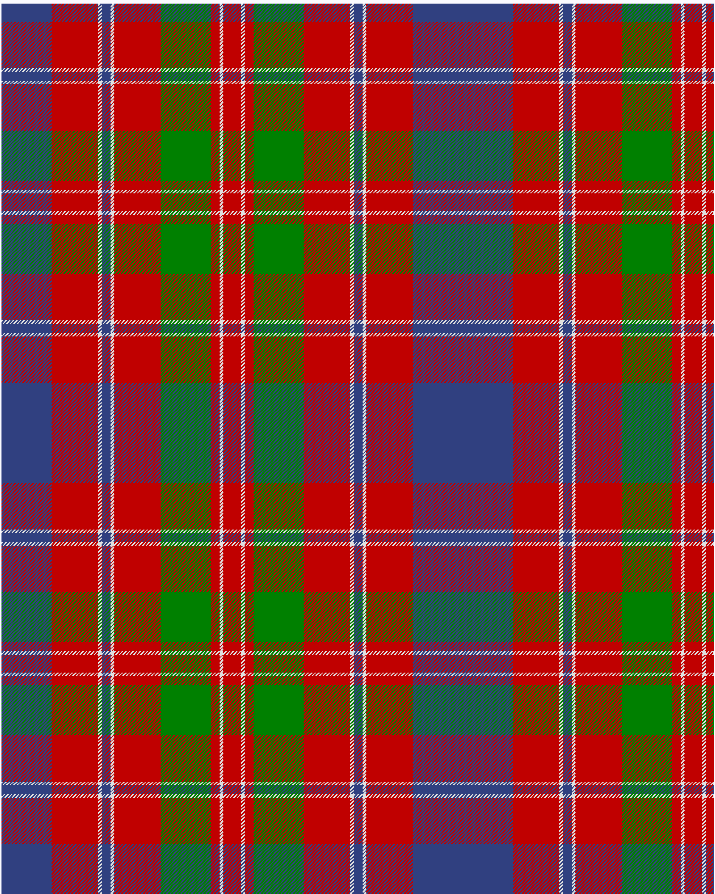

Glenaladale, Plaid

This was sourced from <no value>.  It is a 10 stripes tartan.

Original link http://www.weddslist.com/cgi-bin/tartans/pg.pl?source=sts

## Thread count
B/56 R52 LN4 B10 LN4 R52 G56 R10 LN4 R/10

## Palette
B#304080 G#008000 LN#E0E0E0 R#C00000

# Sample pattern

ID: /variants/b/56/r52/ln4/b10/ln4/r52/g56/r10/ln4/r/10-b304080-g008000-lne0e0e0-rc00000