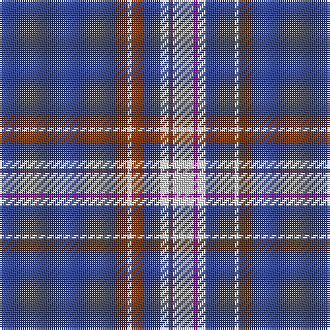

The parent of this is [Baker](/tartans/b/56/t6/ln2/t6/b8/ln4/p2/ln/10/)

This was sourced from weddslist.  It is a [8 stripes tartan](/stripes/stripes8/).

Original link http://www.weddslist.com/cgi-bin/tartans/pg.pl?source=sts

## Thread count
B/56 T6 LN2 T6 B8 LN4 P2 LN/10

## Palette
Each colour and its ΔE from the base-6 reference it is a variant of.

| Colour | Shade | Base | ΔE (OKLab) |
|---|---|---|---|
| B |  `#304080` | B  | 0.01 |
| LN |  `#E0E0E0` | W  | 0.06 |
| P |  `#800080` | B  | 0.17 |
| T |  `#703000` | R  | 0.18 |

# Sample pattern

ID: /variants/b/56/t6/ln2/t6/b8/ln4/p2/ln/10-b304080-lne0e0e0-p800080-t703000/
