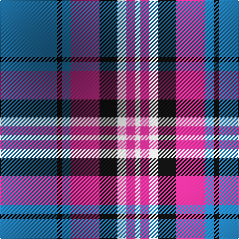

The parent of this is [Yale College, Wrexham](/tartans/b/57/k5/b9/p29/k18/w9/p9/w/5/)

This was sourced from register-of-tartans.  It is a [8 stripes tartan](/stripes/stripes8/).

Original link https://www.tartanregister.gov.uk/tartanDetails.aspx?ref=10464

## Thread count
B/57 K5 B9 P29 K18 W9 P9 W/5

## Palette
Each colour and its ΔE from the base-6 reference it is a variant of.

| Colour | Shade | Base | ΔE (OKLab) |
|---|---|---|---|
| B |  `#2383BF` | B  | 0.20 |
| K |  `#101010` | K  | 0.17 |
| P |  `#C52E8B` | R  | 0.15 |
| W |  `#FFFFFF` | W  | 0.03 |

# Sample pattern

ID: /variants/b/57/k5/b9/p29/k18/w9/p9/w/5-b2383bf-k101010-pc52e8b-wffffff/
