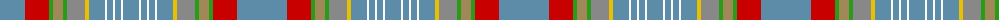

The parent of this is [Saint Joseph de Sorel](/tartans/b/6/b6/b16/r24/g4/lt10/g4/n18/y4/b16/w2/b6/w2/b6/w2/b/16/)

This was sourced from register-of-tartans.  It is a [16 stripes tartan](/stripes/stripes16/).

Original link https://www.tartanregister.gov.uk/tartanDetails.aspx?ref=3638

## Thread count
B/6 B6 B16 R24 G4 LT10 G4 N18 Y4 B16 W2 B6 W2 B6 W2 B/16

## Palette
Each colour and its ΔE from the base-6 reference it is a variant of.

| Colour | Shade | Base | ΔE (OKLab) |
|---|---|---|---|
| B |  `#5C8CA8` | B  | 0.23 |
| G |  `#289C18` | G  | 0.18 |
| LT |  `#A08858` | Y  | 0.21 |
| N |  `#888888` | R  | 0.24 |
| R |  `#C80000` | R  | 0.00 |
| W |  `#FCFCFC` | W  | 0.03 |
| Y |  `#E8C000` | Y  | 0.00 |

ID: /variants/b/6/b6/b16/r24/g4/lt10/g4/n18/y4/b16/w2/b6/w2/b6/w2/b/16-b5c8ca8-g289c18-lta08858-n888888-rc80000-wfcfcfc-ye8c000/
