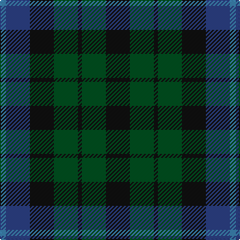

The parent of this is [MacIntyre](/tartans/b/6/ba24/k24/g24/k4/g24/k/24/)

This was sourced from register-of-tartans.  It is a [7 stripes tartan](/stripes/stripes7/).

Original link https://www.tartanregister.gov.uk/tartanDetails.aspx?ref=2483

## Thread count
B/6 Ba24 K24 G24 K4 G24 K/24

## Palette
Each colour and its ΔE from the base-6 reference it is a variant of.

| Colour | Shade | Base | ΔE (OKLab) |
|---|---|---|---|
| B |  `#3C82AF` | B  | 0.20 |
| Ba |  `#2C4084` | B  | 0.00 |
| G |  `#005020` | G  | 0.08 |
| K |  `#101010` | K  | 0.17 |

# Sample pattern

ID: /variants/b/6/ba24/k24/g24/k4/g24/k/24-b3c82af-ba2c4084-g005020-k101010/
