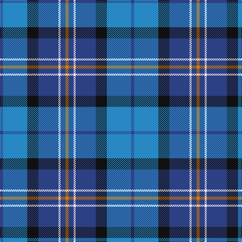

The parent of this is [Icelandair](/tartans/b/6/ba48/k22/b40/w4/b10/o/6/)

This was sourced from register-of-tartans.  It is a [7 stripes tartan](/stripes/stripes7/).

Original link https://www.tartanregister.gov.uk/tartanDetails.aspx?ref=11498

## Thread count
B/6 Ba48 K22 B40 W4 B10 O/6

## Palette
Each colour and its ΔE from the base-6 reference it is a variant of.

| Colour | Shade | Base | ΔE (OKLab) |
|---|---|---|---|
| B |  `#2C4084` | B  | 0.00 |
| Ba |  `#2888C4` | B  | 0.21 |
| K |  `#101010` | K  | 0.17 |
| O |  `#D87C00` | Y  | 0.17 |
| W |  `#FFFFFF` | W  | 0.03 |

# Sample pattern

ID: /variants/b/6/ba48/k22/b40/w4/b10/o/6-b2c4084-ba2888c4-k101010-od87c00-wffffff/
