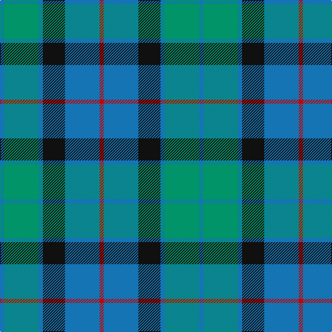

The parent of this is [Flower of Scotland (Universal)](/tartans/b/6/ba50/b6/k32/b50/r/6/)

This was sourced from tartans-authority.  It is a [6 stripes tartan](/stripes/stripes6/).

Original link http://www.tartansauthority.com/tartan-ferret/display/2059/

## Thread count
B/6 Ba50 B6 K32 B50 R/6

## Palette
Each colour and its ΔE from the base-6 reference it is a variant of.

| Colour | Shade | Base | ΔE (OKLab) |
|---|---|---|---|
| B |  `#1474B4` | B  | 0.15 |
| Ba |  `#009468` | G  | 0.16 |
| K |  `#101010` | K  | 0.17 |
| R |  `#C80000` | R  | 0.00 |

# Sample pattern

ID: /variants/b/6/ba50/b6/k32/b50/r/6-b1474b4-ba009468-k101010-rc80000/
