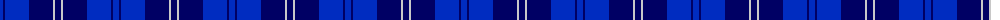
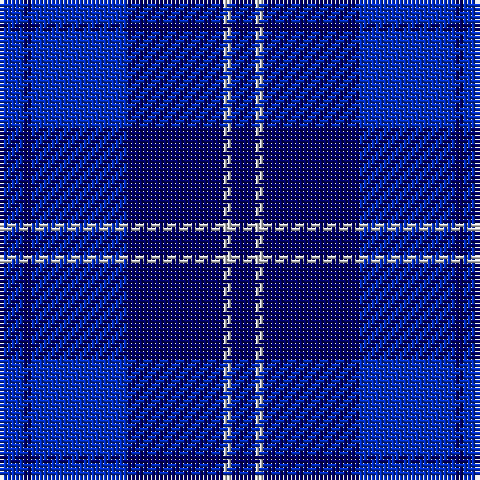

The parent of this is [Erskine Blue (Fashion)](/tartans/b/6/db2/b24/db24/n2/db/6/)

This was sourced from tartans-authority.  It is a [6 stripes tartan](/stripes/stripes6/).

Original link http://www.tartansauthority.com/tartan-ferret/display/4821/

## Thread count
B/6 DB2 B24 DB24 N2 DB/6

## Palette
Each colour and its ΔE from the base-6 reference it is a variant of.

| Colour | Shade | Base | ΔE (OKLab) |
|---|---|---|---|
| B |  `#002CC0` | B  | 0.11 |
| DB |  `#000064` | B  | 0.17 |
| N |  `#C8C8C8` | W  | 0.13 |

# Sample pattern

ID: /variants/b/6/db2/b24/db24/n2/db/6-b002cc0-db000064-nc8c8c8/
