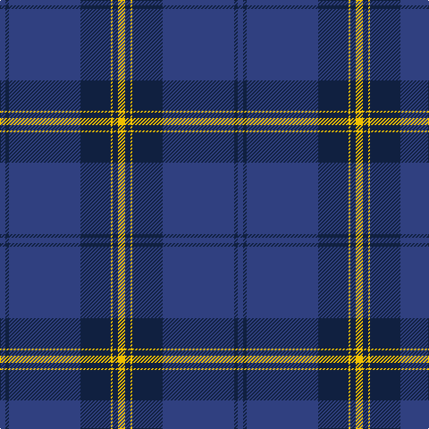

The parent of this is [Danzas](/tartans/b/6/db4/b80/db34/y2/db6/y/8/)

This was sourced from weddslist.  It is a [7 stripes tartan](/stripes/stripes7/).

Original link http://www.weddslist.com/cgi-bin/tartans/pg.pl?source=sts

## Thread count
B/6 DB4 B80 DB34 Y2 DB6 Y/8

## Palette
Each colour and its ΔE from the base-6 reference it is a variant of.

| Colour | Shade | Base | ΔE (OKLab) |
|---|---|---|---|
| B |  `#304080` | B  | 0.01 |
| DB |  `#102040` | B  | 0.15 |
| Y |  `#F0C000` | Y  | 0.01 |

# Sample pattern

ID: /variants/b/6/db4/b80/db34/y2/db6/y/8-b304080-db102040-yf0c000/
