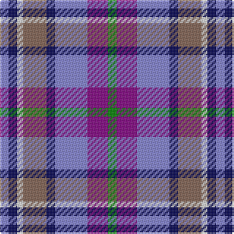

The parent of this is [Scotia](/tartans/b/6/db6/ln4/lt16/db6/b22/p14/g/6/)

This was sourced from weddslist.  It is a [8 stripes tartan](/stripes/stripes8/).

Original link http://www.weddslist.com/cgi-bin/tartans/pg.pl?source=sts

## Thread count
B/6 DB6 LN4 LT16 DB6 B22 P14 G/6

## Palette
Each colour and its ΔE from the base-6 reference it is a variant of.

| Colour | Shade | Base | ΔE (OKLab) |
|---|---|---|---|
| B |  `#8080D0` | B  | 0.24 |
| DB |  `#000050` | B  | 0.20 |
| G |  `#008000` | G  | 0.09 |
| LN |  `#E0E0E0` | W  | 0.06 |
| LT |  `#806050` | R  | 0.17 |
| P |  `#800080` | B  | 0.17 |

# Sample pattern

ID: /variants/b/6/db6/ln4/lt16/db6/b22/p14/g/6-b8080d0-db000050-g008000-lne0e0e0-lt806050-p800080/
