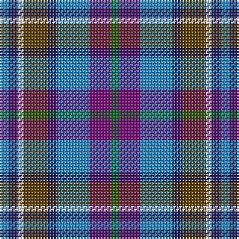

The parent of this is [Scotia Trade Tartan Tartan Number: 89. Earliest known date: 1968 Originally designed by James Allan of East Kilbride and woven by him in 1850. The sett was reconstructed by David Easton, Galashiels, as a National tartan for Scotland. It did not catch on and the tartan is rarely seen today. See products available Copyright © Blair Urquhart, Comrie, 2015](/tartans/b/6/db6/ln4/t16/db6/b22/p14/g/6/)

This was sourced from house-of-tartan.  It is a [8 stripes tartan](/stripes/stripes8/).

Original link http://www.house-of-tartan.scotland.net/house/TartanViewjs.asp?colr=Def&tnam=89

## Thread count
B/6 DB6 LN4 T16 DB6 B22 P14 G/6

## Palette
Each colour and its ΔE from the base-6 reference it is a variant of.

| Colour | Shade | Base | ΔE (OKLab) |
|---|---|---|---|
| B |  `#2888C4` | B  | 0.21 |
| DB |  `#202060` | B  | 0.11 |
| G |  `#006818` | G  | 0.02 |
| LN |  `#E0E0E0` | W  | 0.06 |
| P |  `#780078` | B  | 0.16 |
| T |  `#604000` | G  | 0.14 |

# Sample pattern

ID: /variants/b/6/db6/ln4/t16/db6/b22/p14/g/6-b2888c4-db202060-g006818-lne0e0e0-p780078-t604000/
