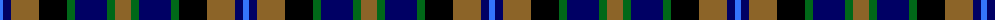
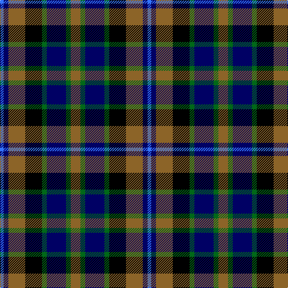

The parent of this is [Hinnigan (Personal)](/tartans/b/6/db8/lt28/k28/g8/db32/g8/lt/16/)

This was sourced from tartans-authority.  It is a [8 stripes tartan](/stripes/stripes8/).

Original link http://www.tartansauthority.com/tartan-ferret/display/5200/

## Thread count
B/6 DB8 LT28 K28 G8 DB32 G8 LT/16

## Palette
Each colour and its ΔE from the base-6 reference it is a variant of.

| Colour | Shade | Base | ΔE (OKLab) |
|---|---|---|---|
| B |  `#3474FC` | B  | 0.23 |
| DB |  `#000064` | B  | 0.17 |
| G |  `#006818` | G  | 0.02 |
| K |  `#000000` | K  | 0.00 |
| LT |  `#8C6428` | R  | 0.16 |

# Sample pattern

ID: /variants/b/6/db8/lt28/k28/g8/db32/g8/lt/16-b3474fc-db000064-g006818-k000000-lt8c6428/
