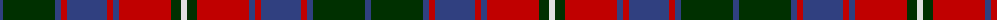

The parent of this is [Roxburgh, Red](/tartans/b/6/dg52/b6/r6/b40/r6/b6/r52/dg10/ln/6/)

This was sourced from weddslist.  It is a [10 stripes tartan](/stripes/stripes10/).

Original link http://www.weddslist.com/cgi-bin/tartans/pg.pl?source=sts

## Thread count
B/6 DG52 B6 R6 B40 R6 B6 R52 DG10 LN/6

## Palette
Each colour and its ΔE from the base-6 reference it is a variant of.

| Colour | Shade | Base | ΔE (OKLab) |
|---|---|---|---|
| B |  `#304080` | B  | 0.01 |
| DG |  `#003000` | G  | 0.18 |
| LN |  `#E0E0E0` | W  | 0.06 |
| R |  `#C00000` | R  | 0.02 |

ID: /variants/b/6/dg52/b6/r6/b40/r6/b6/r52/dg10/ln/6-b304080-dg003000-lne0e0e0-rc00000/
