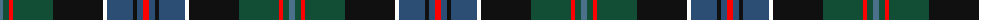

The parent of this is [Loch Freuchie District Tartan Tartan Number: 10725. Earliest known date: 25 October 2012 A tartan for the area around Loch Freuchie near Crieff. The tartan is based on the Murray of Atholl and Breadalbane setts, with differences, to relate the tartan to the particular Loch Freuchie area. Mr MacArthur-Fox has created a tartan for anyone to wear without fear of offending another person or group. See products available Copyright © Blair Urquhart, Comrie, 2015](/tartans/b/6/dg6/r4/dg40/k50/y4/ba26/k4/ba6/r/6/)

This was sourced from house-of-tartan.  It is a [10 stripes tartan](/stripes/stripes10/).

Original link http://www.house-of-tartan.scotland.net/house/TartanViewjs.asp?colr=Def&tnam=10725

## Thread count
B/6 DG6 R4 DG40 K50 Y4 Ba26 K4 Ba6 R/6

## Palette
Each colour and its ΔE from the base-6 reference it is a variant of.

| Colour | Shade | Base | ΔE (OKLab) |
|---|---|---|---|
| B |  `#4A708B` | B  | 0.15 |
| Ba |  `#2C4E75` | B  | 0.05 |
| DG |  `#124D36` | G  | 0.10 |
| K |  `#101010` | K  | 0.17 |
| R |  `#FF0000` | R  | 0.11 |

ID: /variants/b/6/dg6/r4/dg40/k50/y4/ba26/k4/ba6/r/6-b4a708b-ba2c4e75-dg124d36-k101010-rff0000/
