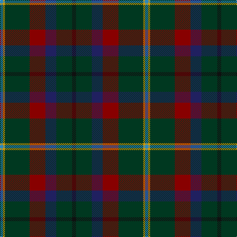

The parent of this is [Mayo, County (District)](/tartans/b/6/dy4/dg50/dr32/db22/dg32/k/8/)

This was sourced from tartans-authority.  It is a [7 stripes tartan](/stripes/stripes7/).

Original link http://www.tartansauthority.com/tartan-ferret/display/2270/

## Thread count
B/6 DY4 DG50 DR32 DB22 DG32 K/8

## Palette
Each colour and its ΔE from the base-6 reference it is a variant of.

| Colour | Shade | Base | ΔE (OKLab) |
|---|---|---|---|
| B |  `#2888C4` | B  | 0.21 |
| DB |  `#202060` | B  | 0.11 |
| DG |  `#003820` | G  | 0.16 |
| DR |  `#880000` | R  | 0.14 |
| DY |  `#D09800` | Y  | 0.11 |
| K |  `#101010` | K  | 0.17 |

# Sample pattern

ID: /variants/b/6/dy4/dg50/dr32/db22/dg32/k/8-b2888c4-db202060-dg003820-dr880000-dyd09800-k101010/
