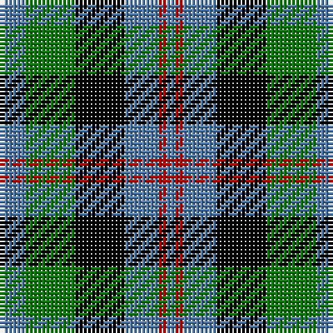

The parent of this is [Wellington, or Waterloo](/tartans/b/6/g12/k12/b8/r2/b/2/)

This was sourced from weddslist.  It is a [6 stripes tartan](/stripes/stripes6/).

Original link http://www.weddslist.com/cgi-bin/tartans/pg.pl?source=sts

## Thread count
B/6 G12 K12 B8 R2 B/2

## Palette
Each colour and its ΔE from the base-6 reference it is a variant of.

| Colour | Shade | Base | ΔE (OKLab) |
|---|---|---|---|
| B |  `#5480B0` | B  | 0.20 |
| G |  `#008000` | G  | 0.09 |
| K |  `#000000` | K  | 0.00 |
| R |  `#C00000` | R  | 0.02 |

# Sample pattern

ID: /variants/b/6/g12/k12/b8/r2/b/2-b5480b0-g008000-k000000-rc00000/
