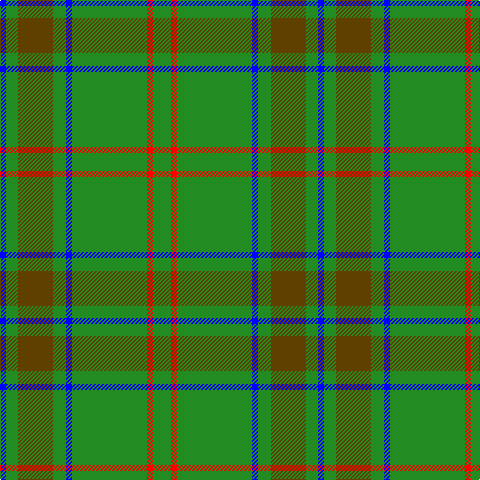

The parent of this is [Glenlivet](/tartans/b/6/g12/t35/g13/b6/g75/r6/g/18/)

This was sourced from register-of-tartans.  It is a [8 stripes tartan](/stripes/stripes8/).

Original link https://www.tartanregister.gov.uk/tartanDetails.aspx?ref=1422

## Thread count
B/6 G12 T35 G13 B6 G75 R6 G/18

## Palette
Each colour and its ΔE from the base-6 reference it is a variant of.

| Colour | Shade | Base | ΔE (OKLab) |
|---|---|---|---|
| B |  `#0000FF` | B  | 0.21 |
| G |  `#228B22` | G  | 0.12 |
| R |  `#FF0000` | R  | 0.11 |
| T |  `#604000` | G  | 0.14 |

# Sample pattern

ID: /variants/b/6/g12/t35/g13/b6/g75/r6/g/18-b0000ff-g228b22-rff0000-t604000/
