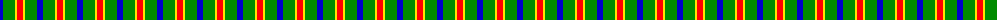
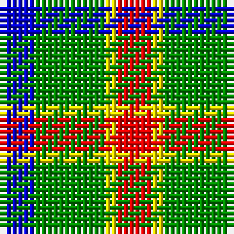

The parent of this is [Delroeux, John Michael Name Tartan Tartan Number: 10654. Earliest known date: 25/06/1985 Designed by Jean Michael Delroeux to show his affinity with Scotland. Colours: red, yellow and blue appear in the Delroeux coat of arms; green is for the landscapes of Scotland. See products available Copyright © Blair Urquhart, Comrie, 2015](/tartans/b/6/g12/y2/r/6/)

This was sourced from house-of-tartan.  It is a [4 stripes tartan](/stripes/stripes4/).

Original link http://www.house-of-tartan.scotland.net/house/TartanViewjs.asp?colr=Def&tnam=10654

## Thread count
B/6 G12 Y2 R/6

## Palette
Each colour and its ΔE from the base-6 reference it is a variant of.

| Colour | Shade | Base | ΔE (OKLab) |
|---|---|---|---|
| B |  `#0000CD` | B  | 0.15 |
| G |  `#008B00` | G  | 0.12 |
| R |  `#FF0000` | R  | 0.11 |
| Y |  `#FFE600` | Y  | 0.10 |

# Sample pattern

ID: /variants/b/6/g12/y2/r/6-b0000cd-g008b00-rff0000-yffe600/
