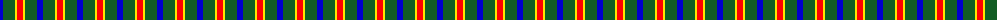
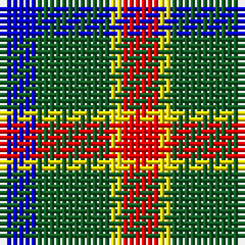

The parent of this is [Delroeux, John Michael (Personal)](/tartans/b/6/g12/y2/r/6/)

This was sourced from register-of-tartans.  It is a [4 stripes tartan](/stripes/stripes4/).

Original link https://www.tartanregister.gov.uk/tartanDetails.aspx?ref=10654

## Thread count
B/6 G12 Y2 R/6

## Palette
Each colour and its ΔE from the base-6 reference it is a variant of.

| Colour | Shade | Base | ΔE (OKLab) |
|---|---|---|---|
| B |  `#0000CD` | B  | 0.15 |
| G |  `#125D24` | G  | 0.04 |
| R |  `#FF0000` | R  | 0.11 |
| Y |  `#FFE600` | Y  | 0.10 |

# Sample pattern

ID: /variants/b/6/g12/y2/r/6-b0000cd-g125d24-rff0000-yffe600/
