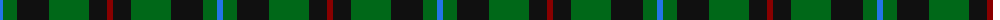

The parent of this is [Holman (Personal)](/tartans/b/6/g14/k32/g40/k18/dr/6/)

This was sourced from tartans-authority.  It is a [6 stripes tartan](/stripes/stripes6/).

Original link http://www.tartansauthority.com/tartan-ferret/display/2646/

## Thread count
B/6 G14 K32 G40 K18 DR/6

## Palette
Each colour and its ΔE from the base-6 reference it is a variant of.

| Colour | Shade | Base | ΔE (OKLab) |
|---|---|---|---|
| B |  `#2474E8` | B  | 0.20 |
| DR |  `#880000` | R  | 0.14 |
| G |  `#006818` | G  | 0.02 |
| K |  `#101010` | K  | 0.17 |

# Sample pattern

ID: /variants/b/6/g14/k32/g40/k18/dr/6-b2474e8-dr880000-g006818-k101010/
