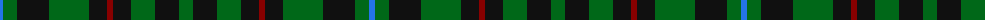

The parent of this is [Holman (Personal)](/tartans/b/6/g14/k32/g40/k18/dr6/k18/g24/k24/g/14/)

This was sourced from register-of-tartans.  It is a [10 stripes tartan](/stripes/stripes10/).

Original link https://www.tartanregister.gov.uk/tartanDetails.aspx?ref=1751

## Thread count
B/6 G14 K32 G40 K18 DR6 K18 G24 K24 G/14

## Palette
Each colour and its ΔE from the base-6 reference it is a variant of.

| Colour | Shade | Base | ΔE (OKLab) |
|---|---|---|---|
| B |  `#2474E8` | B  | 0.20 |
| DG |  `#003820` | G  | 0.16 |
| DR |  `#880000` | R  | 0.14 |
| G |  `#006818` | G  | 0.02 |
| K |  `#101010` | K  | 0.17 |
| O |  `#E86000` | R  | 0.14 |

ID: /variants/b/6/g14/k32/g40/k18/dr6/k18/g24/k24/g/14-b2474e8-dg003820-dr880000-g006818-k101010-oe86000/
