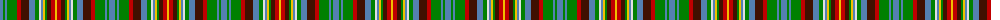

The parent of this is [Haliburton, Highlands of...](/tartans/b/6/g2/b2/g10/r4/dr8/b6/g4/ln2/b2/y2/g2/dr4/r4/y/2/)

This was sourced from weddslist.  It is a [15 stripes tartan](/stripes/stripes15/).

Original link http://www.weddslist.com/cgi-bin/tartans/pg.pl?source=sts

## Thread count
B/6 G2 B2 G10 R4 DR8 B6 G4 LN2 B2 Y2 G2 DR4 R4 Y/2

## Palette
Each colour and its ΔE from the base-6 reference it is a variant of.

| Colour | Shade | Base | ΔE (OKLab) |
|---|---|---|---|
| B |  `#5480B0` | B  | 0.20 |
| DR |  `#401000` | B  | 0.23 |
| G |  `#008000` | G  | 0.09 |
| LN |  `#E0E0E0` | W  | 0.06 |
| R |  `#C00000` | R  | 0.02 |
| Y |  `#F0C000` | Y  | 0.01 |

ID: /variants/b/6/g2/b2/g10/r4/dr8/b6/g4/ln2/b2/y2/g2/dr4/r4/y/2-b5480b0-dr401000-g008000-lne0e0e0-rc00000-yf0c000/
