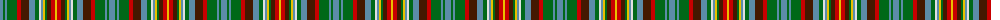

The parent of this is [Haliburton Canadian Tartan Tartan Number: 147. Earliest known date: 1978 From Miss Sinclair. Registration number is possibly a Canadian Patent Office number. See products available Copyright © Blair Urquhart, Comrie, 2015](/tartans/b/6/g2/b2/g10/r4/dr8/b6/g4/ln2/b2/y2/g2/dr4/r4/y/2/)

This was sourced from house-of-tartan.  It is a [15 stripes tartan](/stripes/stripes15/).

Original link http://www.house-of-tartan.scotland.net/house/TartanViewjs.asp?colr=Def&tnam=147

## Thread count
B/6 G2 B2 G10 R4 DR8 B6 G4 LN2 B2 Y2 G2 DR4 R4 Y/2

## Palette
Each colour and its ΔE from the base-6 reference it is a variant of.

| Colour | Shade | Base | ΔE (OKLab) |
|---|---|---|---|
| B |  `#5C8CA8` | B  | 0.23 |
| DR |  `#441800` | B  | 0.22 |
| G |  `#006818` | G  | 0.02 |
| LN |  `#E0E0E0` | W  | 0.06 |
| R |  `#C80000` | R  | 0.00 |
| Y |  `#E8C000` | Y  | 0.00 |

ID: /variants/b/6/g2/b2/g10/r4/dr8/b6/g4/ln2/b2/y2/g2/dr4/r4/y/2-b5c8ca8-dr441800-g006818-lne0e0e0-rc80000-ye8c000/
