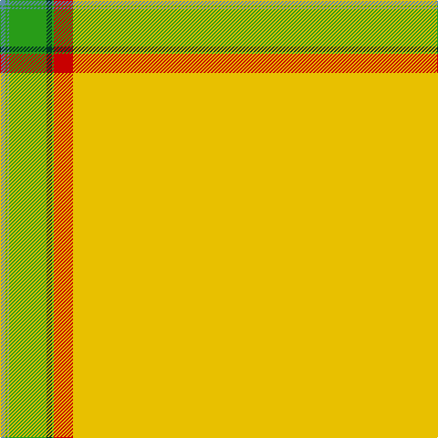

The parent of this is [Manitoba District Tartan Tartan Number: 145. Earliest known date: 1962 A slight modification of the original sett. See products available Copyright © Blair Urquhart, Comrie, 2015](/tartans/b/6/g2/b2/g41/dg6/g2/r21/y/622/)

This was sourced from house-of-tartan.  It is a [8 stripes tartan](/stripes/stripes8/).

Original link http://www.house-of-tartan.scotland.net/house/TartanViewjs.asp?colr=Def&tnam=145

## Thread count
B/6 G2 B2 G41 DG6 G2 R21 Y/622

## Palette
Each colour and its ΔE from the base-6 reference it is a variant of.

| Colour | Shade | Base | ΔE (OKLab) |
|---|---|---|---|
| B |  `#5C8CA8` | B  | 0.23 |
| DG |  `#003820` | G  | 0.16 |
| G |  `#289C18` | G  | 0.18 |
| R |  `#C80000` | R  | 0.00 |
| Y |  `#E8C000` | Y  | 0.00 |

# Sample pattern

ID: /variants/b/6/g2/b2/g41/dg6/g2/r21/y/622-b5c8ca8-dg003820-g289c18-rc80000-ye8c000/
