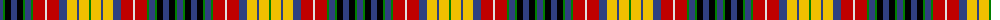

The parent of this is [Buchanan, Incorrect](/tartans/b/6/g2/k6/b6/k6/g2/b6/g2/r12/ln2/r12/b8/y10/b2/y10/g/2/)

This was sourced from weddslist.  It is a [16 stripes tartan](/stripes/stripes16/).

Original link http://www.weddslist.com/cgi-bin/tartans/pg.pl?source=sts

## Thread count
B/6 G2 K6 B6 K6 G2 B6 G2 R12 LN2 R12 B8 Y10 B2 Y10 G/2

## Palette
Each colour and its ΔE from the base-6 reference it is a variant of.

| Colour | Shade | Base | ΔE (OKLab) |
|---|---|---|---|
| B |  `#304080` | B  | 0.01 |
| G |  `#008000` | G  | 0.09 |
| K |  `#000000` | K  | 0.00 |
| LN |  `#E0E0E0` | W  | 0.06 |
| R |  `#C00000` | R  | 0.02 |
| Y |  `#F0C000` | Y  | 0.01 |

ID: /variants/b/6/g2/k6/b6/k6/g2/b6/g2/r12/ln2/r12/b8/y10/b2/y10/g/2-b304080-g008000-k000000-lne0e0e0-rc00000-yf0c000/
