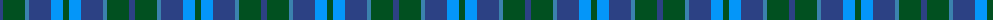
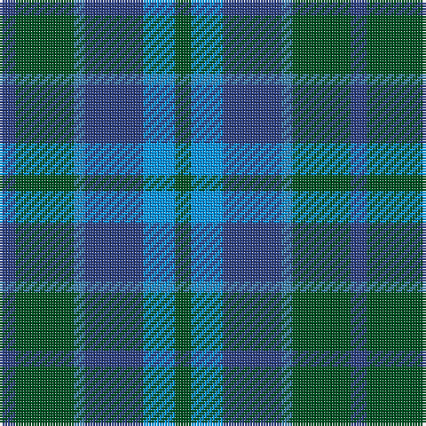

The parent of this is [Unidentified No 29](/tartans/b/6/g22/ba4/b22/bb12/g/6/)

This was sourced from register-of-tartans.  It is a [6 stripes tartan](/stripes/stripes6/).

Original link https://www.tartanregister.gov.uk/tartanDetails.aspx?ref=4395

## Thread count
B/6 G22 Ba4 B22 Bb12 G/6

## Palette
Each colour and its ΔE from the base-6 reference it is a variant of.

| Colour | Shade | Base | ΔE (OKLab) |
|---|---|---|---|
| B |  `#2C4084` | B  | 0.00 |
| Ba |  `#3C82AF` | B  | 0.20 |
| Bb |  `#0596FA` | B  | 0.28 |
| G |  `#005020` | G  | 0.08 |

# Sample pattern

ID: /variants/b/6/g22/ba4/b22/bb12/g/6-b2c4084-ba3c82af-bb0596fa-g005020/
