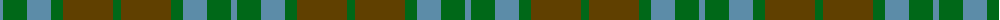
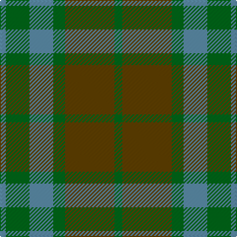

The parent of this is [Canadian Fancy (Fashion)](/tartans/b/6/g24/b24/g12/t50/g/8/)

This was sourced from tartans-authority.  It is a [6 stripes tartan](/stripes/stripes6/).

Original link http://www.tartansauthority.com/tartan-ferret/display/124/

## Thread count
B/6 G24 B24 G12 T50 G/8

## Palette
Each colour and its ΔE from the base-6 reference it is a variant of.

| Colour | Shade | Base | ΔE (OKLab) |
|---|---|---|---|
| B |  `#5C8CA8` | B  | 0.23 |
| G |  `#006818` | G  | 0.02 |
| T |  `#604000` | G  | 0.14 |

# Sample pattern

ID: /variants/b/6/g24/b24/g12/t50/g/8-b5c8ca8-g006818-t604000/
