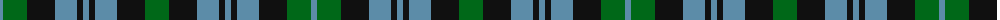

The parent of this is [Wilson's No.166](/tartans/b/6/g24/k28/b22/k6/b6/k6/b22/k28/g/24/)

This was sourced from register-of-tartans.  It is a [10 stripes tartan](/stripes/stripes10/).

Original link https://www.tartanregister.gov.uk/tartanDetails.aspx?ref=4707

## Thread count
B/6 G24 K28 B22 K6 B6 K6 B22 K28 G/24

## Palette
Each colour and its ΔE from the base-6 reference it is a variant of.

| Colour | Shade | Base | ΔE (OKLab) |
|---|---|---|---|
| B |  `#5C8CA8` | B  | 0.23 |
| DG |  `#003820` | G  | 0.16 |
| G |  `#006818` | G  | 0.02 |
| K |  `#101010` | K  | 0.17 |
| LG |  `#789484` | G  | 0.23 |

ID: /variants/b/6/g24/k28/b22/k6/b6/k6/b22/k28/g/24-b5c8ca8-dg003820-g006818-k101010-lg789484/
